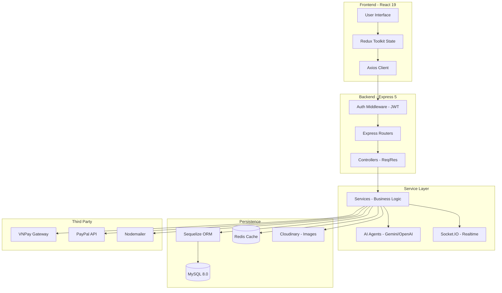

<div align="center">

  <!-- Hero Banner -->
  

  <br />

  <p>
    
    
    
    
    
  </p>

  <p>
    
    
    
    
    
  </p>

  <p>
    <b>TIENTECH Shop</b> là một hệ sinh thái thương mại điện tử đột phá, tích hợp <b>Trí tuệ nhân tạo (AI)</b> chuyên sâu vào từng trải nghiệm mua sắm và quản trị. Hệ thống được xây dựng trên nền tảng công nghệ mới nhất (React 19, Express 5) mang lại hiệu năng tối ưu và khả năng mở rộng cao.
  </p>

  <p>
    <a href="#-cài-đặt--triển-khai"><strong>🚀 Bắt đầu ngay »</strong></a>
    &nbsp;&nbsp;•&nbsp;&nbsp;
    <a href="#-hệ-sinh-thái-ai-đột-phá"><strong>🤖 Khám phá AI »</strong></a>
    &nbsp;&nbsp;•&nbsp;&nbsp;
    <a href="https://github.com/Nguyen-Trung-Tien/Project-App/issues">🐛 Báo lỗi</a>
  </p>

</div>

---

## 📋 Mục lục

- [✨ Tại sao chọn TIENTECH?](#-tại-sao-chọn-tientech)
- [🤖 Hệ sinh thái AI đột phá](#-hệ-sinh-thái-ai-đột-phá)
- [🏗 Kiến trúc hệ thống](#-kiến-trúc-hệ-thống)
- [🛠 Tech Stack toàn diện](#-tech-stack-toàn diện)
- [✨ Tính năng chủ chốt](#-tính-năng-chủ-chốt)
- [📂 Cấu trúc dự án (Anatomy)](#-cấu-trúc-dự-án-anatomy)
- [🗄 Mô hình dữ liệu](#-mô-hình-dữ-liệu)
- [⚡ Cài đặt & Triển khai](#-cài-đặt--triển-khai)
- [🔐 Bảo mật & Hiệu năng](#-bảo-mật--hiệu-năng)
- [🧪 Kiểm thử & Chất lượng](#-kiểm-thử--chất-lượng)
- [🤝 Đóng góp & Phát triển](#-đóng-góp--phát-triển)
- [📄 Giấy phép](#-giấy-phép)

---

## ✨ Tại sao chọn TIENTECH?

Khác với các nền tảng TMĐT truyền thống, **TIENTECH** tập trung vào việc cá nhân hoá trải nghiệm người dùng thông qua dữ liệu và AI:

*   **🛒 Modern Frontend:** Tận dụng sức mạnh của **React 19** với cơ chế render tối ưu, animations mượt mà từ **Framer Motion**.
*   **⚡ High Performance Backend:** API viết trên **Express 5**, hỗ trợ caching **Redis** và tối ưu hoá truy vấn **Sequelize**.
*   **🤖 AI-First Mindset:** Không chỉ là chatbot, AI được tích hợp vào tìm kiếm hình ảnh, tư vấn phong thuỷ và dự báo kinh doanh.
*   **💳 Global & Local Payment:** Hỗ trợ đầy đủ **VNPay (Nội địa)** và **PayPal (Quốc tế)**.
*   **📊 Data-Driven Admin:** Dashboard trực quan với các chỉ số kinh doanh được AI phân tích và đưa ra lời khuyên chiến lược.

---

## 🤖 Hệ sinh thái AI đột phá

Đây là linh hồn của dự án, sử dụng các mô hình ngôn ngữ lớn (LLMs) như **Gemini 2.5 Flash** và **OpenAI GPT-4**:

| Tính năng | Công nghệ | Mô tả |
| :--- | :--- | :--- |
| **Omni-Chatbot** | Gemini / OpenAI | Trợ lý ảo hiểu ngữ cảnh, hỗ trợ tra cứu đơn hàng, tư vấn sản phẩm và giải đáp thắc mắc 24/7. |
| **Tư vấn Phong thuỷ** | Gemini AI | Phân tích năm sinh người dùng để gợi ý các sản phẩm (màu sắc, chất liệu) phù hợp nhất với bản mệnh. |
| **Visual Search** | Vision AI | Tìm kiếm sản phẩm bằng hình ảnh. Người dùng chỉ cần upload ảnh, hệ thống sẽ tìm sản phẩm tương ứng. |
| **Price Predictor** | Machine Learning | Dự đoán xu hướng giá của sản phẩm trong tương lai giúp người dùng chọn thời điểm mua tốt nhất. |
| **AI Insights Admin** | Gemini AI | Chuyên gia phân tích ảo cho Admin: Tự động phân tích tồn kho, doanh số và đề xuất chiến dịch marketing. |

---

## 🏗 Kiến trúc hệ thống

Dự án tuân thủ nghiêm ngặt mô hình **Clean Architecture** với phân lớp rõ ràng:



---

## 🛠 Tech Stack toàn diện

### Frontend Ecosystem
- **Core:** React 19 (Latest), Vite 7 (Super fast build)
- **State:** Redux Toolkit + Redux Persist
- **Styling:** Tailwind CSS 4 (Utility-first), SASS
- **Animation:** Framer Motion 12
- **Visualization:** Recharts (Admin Dashboards)
- **Communication:** Axios + Socket.IO Client

### Backend Ecosystem
- **Core:** Node.js 22 (LTS), Express 5 (Next-gen)
- **ORM:** Sequelize 6 + MySQL 2
- **Caching:** Redis (Performance boost)
- **Security:** Passport.js (Google OAuth), JWT, bcryptjs, Zod (Validation), Express Rate Limit
- **Media:** Cloudinary SDK
- **Task Scheduling:** Node-cron (Auto update Flash Sales/Orders)

---

## ✨ Tính năng chủ chốt

### 🛍 Dành cho Khách hàng
*   **Smart Authentication:** Đăng nhập Google, xác thực OTP qua Email, quản lý phiên bản với Refresh Token.
*   **Advanced Shopping:** Giỏ hàng thông minh, áp mã Voucher đa lớp, tìm kiếm sản phẩm ngữ nghĩa.
*   **Interactive Review:** Đánh giá sản phẩm kèm hình ảnh, phản hồi từ Admin.
*   **Real-time Notification:** Nhận thông báo trạng thái đơn hàng ngay lập tức.
*   **Wishlist & History:** Lưu sản phẩm yêu thích và xem lại lịch sử mua sắm chi tiết.

### 📊 Dành cho Quản trị viên
*   **Enterprise Dashboard:** Thống kê doanh thu theo ngày/tháng/năm bằng biểu đồ sinh động.
*   **Inventory Control:** Quản lý kho hàng, biến thể sản phẩm (Màu sắc, kích cỡ, dung lượng...).
*   **Promotion Engine:** Tạo các chiến dịch Flash Sale, quản lý mã giảm giá tự động.
*   **Customer Insights:** Theo dõi hành vi khách hàng và các đánh giá tiêu cực để cải thiện dịch vụ.
*   **Order Fulfillment:** Quy trình xử lý đơn hàng chuẩn TMĐT từ Chờ duyệt -> Giao hàng -> Hoàn tất/Hoàn tiền.

---

## 📂 Cấu trúc dự án (Anatomy)

```text
Project-App/
├── 📁 BackEnd/
│   ├── 📁 src/
│   │   ├── 📁 config/          # Cấu hình DB, Redis, Cloudinary, Passport
│   │   ├── 📁 controller/      # Xử lý Request/Response (20+ controllers)
│   │   ├── 📁 services/        # Logic nghiệp vụ chính (Service Layer)
│   │   ├── 📁 models/          # Định nghĩa Database Schema (20+ tables)
│   │   ├── 📁 routers/         # Định nghĩa các Endpoint API
│   │   ├── 📁 middleware/      # Auth, Validation, Error Handling
│   │   ├── 📁 cron/            # Các tác vụ tự động (Flash Sale, Orders)
│   │   └── service.js          # File chạy chính của server
│   └── 📁 tests/               # Unit & Integration tests
│
├── 📁 FrontEnd/
│   ├── 📁 src/
│   │   ├── 📁 Admin/           # Module dành riêng cho quản trị viên
│   │   ├── 📁 api/             # Các hàm gọi API tập trung
│   │   ├── 📁 components/      # UI Components dùng chung (25+)
│   │   ├── 📁 pages/           # Các trang giao diện chính (20+)
│   │   ├── 📁 redux/           # Quản lý Global State
│   │   └── 📁 hooks/           # Custom hooks xử lý logic UI
│   └── vite.config.js          # Cấu hình build frontend
│
└── 📁 deploy/                  # Cấu hình Docker & Kubernetes (Local)
```

---

## ⚡ Cài đặt & Triển khai

### 1. Yêu cầu hệ thống
*   Node.js v22.x hoặc mới hơn.
*   MySQL 8.0.
*   Redis (Tùy chọn, để bật tính năng cache).

### 2. Khởi tạo Backend
```bash
cd BackEnd
npm install
cp .env.example .env # Cấu hình các key AI và DB trong này
npx sequelize-cli db:migrate # Tạo cấu trúc bảng
npm run dev # Chạy ở port 8080
```

### 3. Khởi tạo Frontend
```bash
cd FrontEnd
npm install
cp .env.example .env
npm run dev # Chạy ở port 5173
```

---

## 🔐 Bảo mật & Hiệu năng

*   **Security:**
    *   Hệ thống xác thực 2 lớp với JWT Access & Refresh tokens.
    *   Chặn tấn công Brute-force bằng **Rate Limiting**.
    *   Validation dữ liệu đầu vào cực kỳ chặt chẽ với **Zod & Express Validator**.
    *   Bảo mật thông tin thanh toán theo chuẩn API của VNPay/PayPal.
*   **Performance:**
    *   Sử dụng **Redis** để cache các truy vấn sản phẩm phổ biến, giảm tải cho MySQL.
    *   Tối ưu hóa hình ảnh thông qua CDN của **Cloudinary**.
    *   Frontend sử dụng **Code Splitting** và **Lazy Loading** để tăng tốc độ tải trang đầu tiên.

---

## 🧪 Kiểm thử & Chất lượng

Dự án được bảo vệ bởi hệ thống test tự động:
*   **Backend:** Sử dụng **Jest** và **Supertest** để kiểm tra API.
*   **Linting:** Sử dụng **ESLint** với cấu hình nghiêm ngặt để đảm bảo code sạch.
*   **CI/CD:** Tích hợp **GitHub Actions** để tự động kiểm tra code mỗi khi có Pull Request.

Để chạy test:
```bash
cd BackEnd
npm test
```

---

## 🤝 Đóng góp & Phát triển

Chúng tôi luôn chào đón các đóng góp từ cộng đồng!
1.  **Fork** dự án.
2.  Tạo nhánh tính năng: `git checkout -b feature/AmazingFeature`.
3.  Commit các thay đổi: `git commit -m 'Add some AmazingFeature'`.
4.  Push lên nhánh: `git push origin feature/AmazingFeature`.
5.  Mở một **Pull Request**.

---

## 📄 Giấy phép

Dự án này được cấp phép theo Giấy phép **MIT** - xem tệp [LICENSE](LICENSE) để biết chi tiết.

---

<div align="center">
  <p>Được xây dựng với ❤️ bởi <b>Nguyễn Trung Tiến</b></p>
  <p>
    <a href="https://github.com/Nguyen-Trung-Tien">
      
    </a>
  </p>
  
</div>
