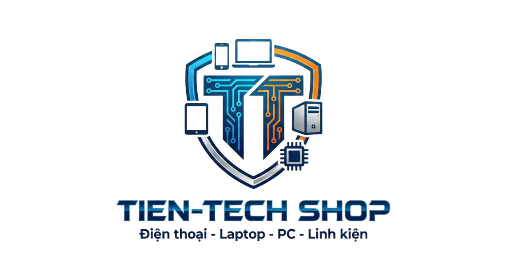
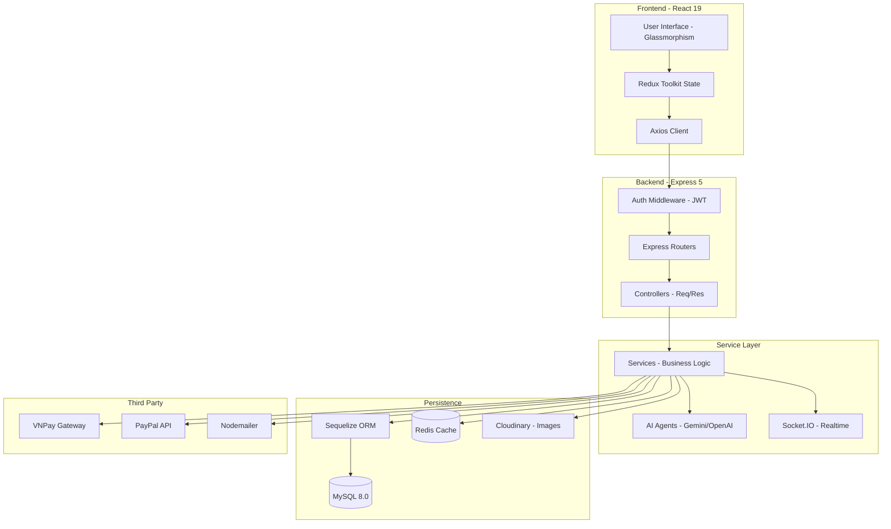

<div align="center">

  <!-- Logo Header -->
  <a href="https://github.com/Nguyen-Trung-Tien/Project-App">
    
  </a>

  <!-- Hero Banner -->
  

  <br />

  <p>
    
    
    
    
    
  </p>

  <p>
    
    
    
    
    
  </p>

  <p>
    <b>TIENTECH Shop</b> là hệ sinh thái thương mại điện tử hàng đầu tích hợp <b>Trí tuệ nhân tạo (AI)</b> chuyên sâu vào mua sắm & quản trị. Dự án xây dựng trên nền tảng <b>React 19</b> & <b>Express 5</b> mang lại tốc độ phản hồi nhanh tức thì cùng giao diện <b>Glassmorphic High-Tech</b> đẳng cấp.
  </p>

  <p>
    <a href="#-cài-đặt--triển-khai"><strong>🚀 Bắt đầu ngay »</strong></a>
    &nbsp;&nbsp;•&nbsp;&nbsp;
    <a href="#-hệ-sinh-thái-ai-đột-phá"><strong>🤖 Khám phá AI »</strong></a>
    &nbsp;&nbsp;•&nbsp;&nbsp;
    <a href="https://github.com/Nguyen-Trung-Tien/Project-App/issues">🐛 Báo lỗi</a>
  </p>

</div>

---

## 📋 Mục lục

- [✨ Tại sao chọn TIENTECH?](#-tại-sao-chọn-tientech)
- [🔥 Đột phá UI/UX & Nâng cấp mới nhất](#-đột-phá-uiux--nâng-cấp-mới-nhất)
- [🤖 Hệ sinh thái AI đột phá](#-hệ-sinh-thái-ai-đột-phá)
- [🏗 Kiến trúc hệ thống](#-kiến-trúc-hệ-thống)
- [🛠 Tech Stack toàn diện](#-tech-stack-toàn-diện)
- [✨ Tính năng chủ chốt](#-tính-năng-chủ-chốt)
- [📂 Cấu trúc dự án (Anatomy)](#-cấu-trúc-dự-án-anatomy)
- [⚡ Cài đặt & Triển khai](#-cài-đặt--triển-khai)
- [🔐 Bảo mật & Hiệu năng](#-bảo-mật--hiệu-năng)
- [🤝 Đóng góp & Phát triển](#-đóng-góp--phát-triển)

---

## ✨ Tại sao chọn TIENTECH?

Khác với các nền tảng TMĐT truyền thống, **TIENTECH** tập trung cá nhân hóa trải nghiệm người dùng thông qua dữ liệu và AI:

*   **🛒 Modern Frontend:** Tận dụng sức mạnh **React 19** với cơ chế render mượt mà từ **Framer Motion**, chuẩn **Glassmorphism Design System**.
*   **⚡ High Performance Backend:** API viết trên **Express 5**, hỗ trợ **Redis Cache**, Rate Limiter chống nghẽn và tối ưu hóa **Sequelize**.
*   **🤖 AI-First Ecosystem:** Tích hợp Chatbot thông minh, Visual Image Search, tư vấn Phong thủy, Dự báo xu hướng giá và AI Insights Admin.
*   **💳 Global & Local Payment:** Hỗ trợ thanh toán toàn diện **VNPay (Nội địa)** và **PayPal (Quốc tế)**.
*   **📊 Enterprise Admin:** Dashboard trực quan kết hợp tìm kiếm toàn cục phím tắt `Ctrl + K`.

---

## 🔥 Đột phá UI/UX & Nâng cấp mới nhất

| Hạng mục | Chi tiết nâng cấp |
| :--- | :--- |
| **🔍 Search System (Ctrl + K)** | Tìm kiếm siêu tốc bằng phím tắt `Ctrl + K`, hỗ trợ AI Vision Search, Voice Search (gợi ý từ khóa & lịch sử tìm kiếm). |
| **🎯 System-Wide Filter** | Bộ lọc thông minh toàn hệ thống: chọn nhanh 1-tap khoảng giá preset (`< 5 triệu`, `5-15 triệu`, `15-30 triệu`, `> 30 triệu`) & icon thông số kỹ thuật. |
| **✨ Glassmorphic Modal & Popup** | Modal thông báo nảy nổ mượt (Spring Animation) kèm icon phát sáng trạng thái (`Danger`, `Success`, `Warning`, `Info`). |
| **🍞 Premium Toast System** | Đổi mới toàn bộ thông báo Toast dạng kính mờ 3D (`backdrop-blur-xl`), góc phải màn hình với thanh đếm ngược Gradient mượt mà. |
| **🔒 Remember Me & Auth UI** | Tính năng Ghi nhớ đăng nhập tự động lưu credentials an toàn; giao diện Đăng nhập/Đăng ký chuẩn Light/Dark mode. |
| **🛍 Checkout Flow & 404** | Trang Checkout Success/Failed thiết kế code tham chiếu 1-click copy & đếm ngược tự động; trang 404 hoành tráng. |

---

## 🤖 Hệ sinh thái AI đột phá

Linh hồn của dự án sử dụng các mô hình AI tiên tiến như **Gemini 2.5 Flash** và **OpenAI GPT-4**:

| Tính năng | Công nghệ | Mô tả |
| :--- | :--- | :--- |
| **Omni-Chatbot** | Gemini / OpenAI | Trợ lý ảo hiểu ngữ cảnh, hỗ trợ tra cứu đơn hàng, tư vấn sản phẩm và giải đáp thắc mắc 24/7. |
| **Tư vấn Phong thủy** | Gemini AI | Phân tích năm sinh người dùng để gợi ý sản phẩm (màu sắc, bản mệnh) phù hợp nhất. |
| **Visual Search** | Vision AI | Tìm kiếm sản phẩm bằng hình ảnh thông minh qua camera hoặc tải ảnh trực tiếp. |
| **Price Predictor** | Machine Learning | Dự đoán xu hướng giá sản phẩm trong tương lai giúp khách hàng chọn thời điểm mua tối ưu. |
| **AI Insights Admin** | Gemini AI | Chuyên gia phân tích ảo cho Admin: Tự động phân tích tồn kho, doanh số và đề xuất chiến dịch marketing. |

---

## 🏗 Kiến trúc hệ thống

Dự án tuân thủ nghiêm ngặt mô hình **Clean Architecture**:



---

## 🛠 Tech Stack toàn diện

### Frontend Ecosystem
- **Core:** React 19 (Latest), Vite 7 (Super fast build)
- **State:** Redux Toolkit + Redux Persist
- **Styling:** Tailwind CSS 4 (Utility-first), SASS
- **Animation:** Framer Motion 12
- **Visualization:** Recharts (Admin Dashboards)
- **Communication:** Axios + Socket.IO Client

### Backend Ecosystem
- **Core:** Node.js 22 (LTS), Express 5 (Next-gen)
- **ORM:** Sequelize 6 + MySQL 2
- **Caching:** Redis (Performance boost)
- **Security:** Passport.js (Google OAuth), JWT, bcryptjs, Zod (Validation), Express Rate Limit
- **Media:** Cloudinary SDK
- **Task Scheduling:** Node-cron (Auto update Flash Sales/Orders)

---

## ✨ Tính năng chủ chốt

### 🛍 Dành cho Khách hàng
*   **Smart Authentication:** Đăng nhập Google, xác thực OTP qua Email, Ghi nhớ mật khẩu an toàn.
*   **Advanced Shopping:** Giỏ hàng thông minh, áp mã Voucher đa lớp, tìm kiếm sản phẩm ngữ nghĩa & Visual Search.
*   **Interactive Review:** Đánh giá sản phẩm kèm hình ảnh, phản hồi từ Admin.
*   **Real-time Notification:** Nhận thông báo trạng thái đơn hàng ngay lập tức.
*   **Wishlist & History:** Lưu sản phẩm yêu thích và xem lại lịch sử mua sắm chi tiết.

### 📊 Dành cho Quản trị viên
*   **Enterprise Dashboard:** Thống kê doanh thu theo ngày/tháng/năm bằng biểu đồ sinh động.
*   **Global Search (Ctrl + K):** Tìm nhanh Sản phẩm, Đơn hàng và Người dùng trên thanh Header Admin.
*   **Inventory Control:** Quản lý kho hàng, biến thể sản phẩm (Màu sắc, kích cỡ, dung lượng...).
*   **Promotion Engine:** Tạo các chiến dịch Flash Sale, quản lý mã giảm giá tự động.
*   **Order Fulfillment:** Quy trình xử lý đơn hàng chuẩn TMĐT từ Chờ duyệt -> Giao hàng -> Hoàn tất/Hoàn tiền.

---

## 📂 Cấu trúc dự án (Anatomy)

```text
Project-App/
├── 📁 BackEnd/
│   ├── 📁 src/
│   │   ├── 📁 config/          # Cấu hình DB, Redis, Cloudinary, Passport
│   │   ├── 📁 controller/      # Xử lý Request/Response
│   │   ├── 📁 services/        # Logic nghiệp vụ chính (Service Layer)
│   │   ├── 📁 models/          # Định nghĩa Database Schema
│   │   ├── 📁 middleware/      # Auth, Rate Limiter, Error Handling
│   │   └── service.js          # Main server entrypoint
│   └── 📁 tests/               # Unit & Integration tests
│
├── 📁 FrontEnd/
│   ├── 📁 src/
│   │   ├── 📁 Admin/           # Module quản trị viên
│   │   ├── 📁 api/             # API clients
│   │   ├── 📁 components/      # Glassmorphism UI Components
│   │   ├── 📁 pages/           # Client pages
│   │   └── 📁 redux/           # Global State
│   └── vite.config.js          # Build configuration
│
└── 📁 deploy/                  # Docker & Deployment configs
```

---

## ⚡ Cài đặt & Triển khai

### 1. Yêu cầu hệ thống
*   Node.js v22.x hoặc mới hơn.
*   MySQL 8.0.
*   Redis (Tùy chọn, để bật tính năng cache).

### 2. Khởi tạo Backend
```bash
cd BackEnd
npm install
cp .env.example .env
npx sequelize-cli db:migrate
npm run dev
```

### 3. Khởi tạo Frontend
```bash
cd FrontEnd
npm install
cp .env.example .env
npm run dev
```

---

## 🔐 Bảo mật & Hiệu năng

*   **Security:**
    *   Hệ thống xác thực 2 lớp với JWT Access & Refresh tokens.
    *   Chặn tấn công Brute-force bằng **Rate Limiting**.
    *   Validation dữ liệu đầu vào chặt chẽ với **Zod & Express Validator**.
*   **Performance:**
    *   Sử dụng **Redis** để cache các truy vấn sản phẩm phổ biến.
    *   Tối ưu hóa hình ảnh qua CDN **Cloudinary**.
    *   Frontend sử dụng **Code Splitting** và **Lazy Loading** giúp tải trang nhanh dưới 1 giây.

---

## 🤝 Đóng góp & Phát triển

Chúng tôi luôn chào đón các đóng góp từ cộng đồng!
1.  **Fork** dự án.
2.  Tạo nhánh tính năng: `git checkout -b feature/AmazingFeature`.
3.  Commit các thay đổi: `git commit -m 'Add some AmazingFeature'`.
4.  Push lên nhánh: `git push origin feature/AmazingFeature`.
5.  Mở một **Pull Request**.

---

## 📄 Giấy phép

Dự án này được cấp phép theo Giấy phép **MIT** - xem tệp [LICENSE](LICENSE) để biết chi tiết.

---

<div align="center">
  <p>Được xây dựng với ❤️ bởi <b>Nguyễn Trung Tiến</b></p>
  <p>
    <a href="https://github.com/Nguyen-Trung-Tien">
      
    </a>
  </p>
  
</div>
