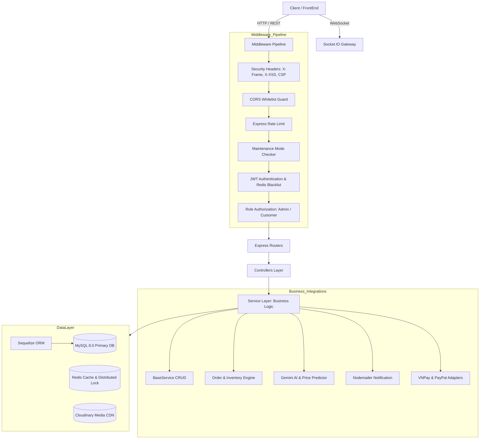
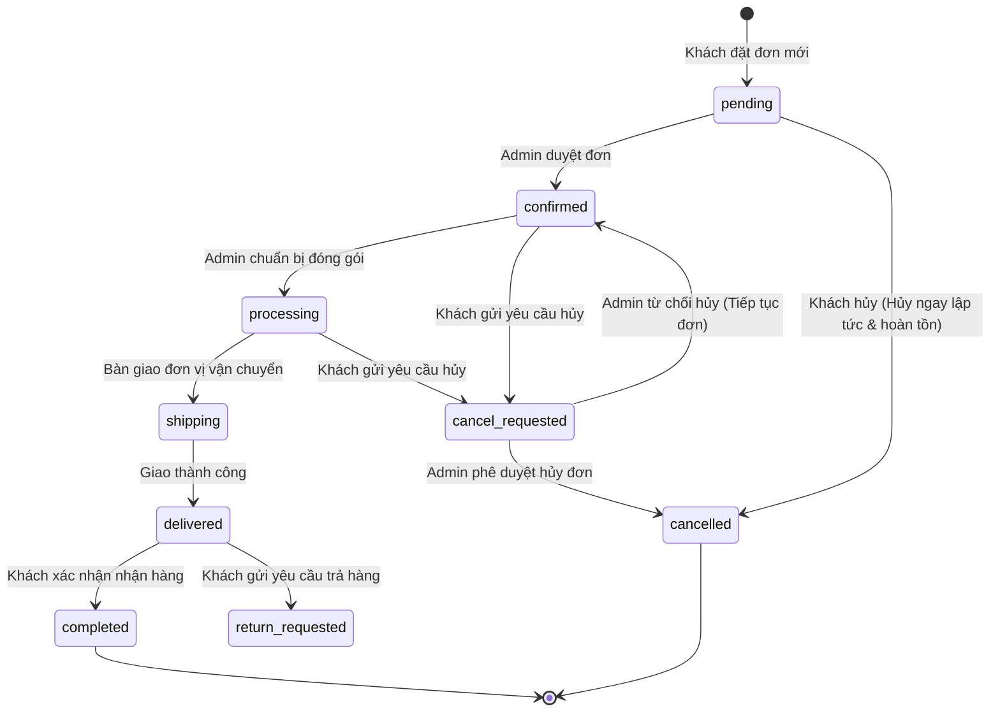

# TIENTECH-Shop System Architecture Document

> **Phiên bản tài liệu:** 1.0.0  
> **Trạng thái:** Production-Ready  
> **Ngôn ngữ & Nền tảng:** Node.js 22 LTS, Express 5, React 19, MySQL 8, Redis 6+

---

## 1. Tổng quan Kiến trúc (High-Level Overview)

Dự án **TIENTECH-Shop** được tổ chức dưới dạng **Monorepo** phân tầng rõ rệt:
- **`BackEnd/`**: Cung cấp RESTful API, Real-time Socket Gateway, AI Pipelines và Task Scheduling. Tuân thủ **Clean Layered Architecture**.
- **`FrontEnd/`**: Ứng dụng Single Page Application (SPA) phát triển trên **React 19 + Vite 7**, sử dụng **Tailwind CSS 4**, **Framer Motion** và ngôn ngữ thiết kế **Glassmorphism**.
- **`deploy/local/`**: Toàn bộ Kubernetes Manifests và cấu hình triển khai micro-services cục bộ hoặc cụm Cloud K8s.

```
TIENTECH-Shop (Monorepo Root)
├── BackEnd/              # Express 5, Sequelize ORM, Socket.IO, Redis, Gemini/OpenAI
│   ├── src/
│   │   ├── config/       # Kết nối DB, Redis, Cloudinary, Gemini, Passport
│   │   ├── controllers/  # Tiếp nhận Request, điều phối Response
│   │   ├── services/     # Tầng Logic nghiệp vụ cốt lõi (Business Layer)
│   │   ├── models/       # Định nghĩa bảng và quan hệ cơ sở dữ liệu (Sequelize)
│   │   ├── middleware/   # JWT Auth, Rate Limiter, Role Guard, Maintenance Mode
│   │   ├── cron/         # Task tự động (Đơn hàng, Tồn kho, Flash Sale)
│   │   └── utils/        # ServiceResult, AppError, jwtHelper, formatter
│   └── tests/            # Test suite Jest (Unit & Integration)
├── FrontEnd/             # React 19, Redux Toolkit, Tailwind CSS 4, Framer Motion
│   └── src/
│       ├── Admin/        # Phân hệ quản trị (Dashboard, Quản lý sản phẩm/đơn/khách)
│       ├── pages/        # Trang giao diện khách hàng (Home, Detail, Cart, Checkout, Order)
│       ├── components/   # UI Components kính mờ (Glassmorphic Components)
│       ├── redux/        # Quản lý Global State (User, Cart, Settings)
│       └── api/          # HTTP Client (Axios interceptor kèm tự động gắn Access Token)
├── deploy/local/         # Kubernetes manifests (Deployments, Services, PVC)
└── docs/                 # Tài liệu kỹ thuật chi tiết
```

---

## 2. Kiến trúc Tầng Backend (Clean Layered Architecture)

Backend tuân thủ nghiêm ngặt nguyên tắc **Single Responsibility Principle (SRP)** và **Separation of Concerns**:



### 2.1. Chuẩn hóa Luồng Dữ liệu (ServiceResult Pattern)
Mọi Service trong Backend bắt buộc trả về một đối tượng chuẩn `ServiceResult`:
```javascript
{
  errCode: 0,              // 0: Thành công, > 0: Lỗi nghiệp vụ, -1: Lỗi hệ thống
  errMessage: "OK",        // Thông điệp phản hồi rõ ràng
  data: { ... },           // Dữ liệu trả về (Object, Array, hoặc null)
  meta: { ... }            // Phân trang (totalItems, totalPages, currentPage)
}
```
Controllers không trực tiếp truy vấn cơ sở dữ liệu; Controller chỉ nhận kết quả từ Service và gọi helper `handleResponse(res, result)` để đồng bộ mã HTTP Status (`200`, `400`, `401`, `403`, `500`).

---

## 3. Máy Trạng thái Đơn hàng (Order State Machine)

Hệ thống quản lý quy trình vòng đời đơn hàng khép kín với các kiểm tra chuyển trạng thái (`validTransitions`):



### 3.1. Cơ chế Hủy Đơn Hàng cho Khách (Customer Order Cancellation)
1. **Đơn ở trạng thái `pending`:**
   - Khách có quyền hủy trực tiếp. Trạng thái lập tức chuyển sang `cancelled`.
   - Hệ thống tự động hoàn lại số lượng tồn kho (`totalStock`, biến thể `stock`), giảm biến thể `sold`, và hoàn lại lượt dùng mã giảm giá (`Voucher.usedCount`).
   - Nếu đơn đã thanh toán (`paid`), hệ thống kích hoạt hoàn tiền tự động qua `PaymentService.refundPayment`.
2. **Đơn ở trạng thái `confirmed`, `processing`, `shipping`:**
   - Khách gửi yêu cầu hủy với lý do cụ thể (`cancel_requested`).
   - Đơn lưu vết lịch sử (`confirmationHistory`) ghi nhận tác nhân yêu cầu.
   - Hệ thống phát thông báo Real-time đến `admin_room` để Quản trị viên duyệt trên trang **Admin > Quản lý Hủy đơn**.

---

## 4. Hệ thống Phòng thủ & Bảo mật (Security Blueprint)

1. **Bảo vệ Token & Đăng xuất An toàn (JWT + Redis Blacklist):**
   - Access Token và Refresh Token được thiết lập qua **HttpOnly, Secure, SameSite=Strict cookies**.
   - Tuyệt đối không trả token nhạy cảm trong JSON response của login/refresh-token.
   - Khi người dùng đăng xuất, Access Token được đưa vào danh sách đen (Blacklist) trong Redis với thời gian sống (TTL) tương ứng với thời gian hết hạn còn lại của token.
2. **Bảo vệ Chống Bypass Thanh toán (Payment Idempotency & Provider Verification):**
   - Số tiền thanh toán (`amount`) luôn được truy xuất và xác định trực tiếp từ `Order.totalPrice` trong database, bỏ qua mọi giá trị do client gửi lên.
   - Khách hàng không thể tự đánh dấu giao dịch thanh toán trực tuyến là `completed` / `paid`.
   - Chỉ Webhook/IPN hợp lệ từ Payment Provider (như VNPay) mới có quyền cập nhật trạng thái `paid`.
   - Khóa phân tán Redis lock (`payment_confirm_{orderId}`) có token ngẫu nhiên và atomic compare-and-delete ngăn chặn race-conditions và xử lý trùng lặp IPN.
3. **Kiểm soát Tần suất Truy cập (Rate Limiter) & Phòng chống CSRF:**
   - Rate limiter tổng quát bảo vệ toàn bộ `/api/` (1000 req/15 phút trên Production).
   - Rate limiter đặc thù cho các endpoint nhạy cảm như `/api/v1/user/forgot-password` (tối đa 5 lần/15 phút).
   - Middleware CSRF Protection bảo vệ toàn bộ các mutation endpoints (`POST`, `PUT`, `PATCH`, `DELETE`) xác thực qua cookie, đối chiếu `Origin` và `Referer` với danh sách `allowedOrigins`.
4. **Quy tắc Sở hữu Đơn hàng & Trả hàng Cấp Mục (Item-Level Return Flow):**
   - API tạo đơn hàng (`create-new-order`) ép buộc `userId = req.user.id` cho khách hàng, ngăn chặn việc tạo đơn hoặc sử dụng voucher/giỏ hàng thay cho tài khoản khác.
   - Quy trình đổi/trả hàng được quản lý chi tiết tới từng `OrderItem` với các trạng thái: `none` -> `requested` -> `approved` / `rejected` -> `completed`.
   - Khách chỉ có thể yêu cầu trả hàng cho item trong đơn hàng của chính mình. Admin chỉ có thể duyệt/từ chối các item đang ở trạng thái `requested`, đảm bảo tính lũy thừa (idempotency) và hoàn tồn kho đúng một lần duy nhất.
5. **Tiêu chuẩn Header Bảo mật (Security Headers):**
   - Tích hợp Content Security Policy (CSP), HTTP Strict Transport Security (HSTS trên production), Permissions-Policy (`camera=(), microphone=(), geolocation=()`), `X-Frame-Options: DENY`, `X-Content-Type-Options: nosniff`.
6. **Phòng chống Lỗ hổng Tràn hiển thị (Text Overflow Defense):**
   - Toàn bộ văn bản hệ thống (địa chỉ, email, tên sản phẩm dài, mã đơn, lý do hủy đơn) áp dụng luật CSS:
     - `overflow-wrap: anywhere;` và `break-words;`
     - Các container con dạng flex áp dụng `min-w-0 flex-1 overflow-hidden` để ngăn chặn việc nội dung dài đẩy tràn màn hình ngang của thiết bị di động.

---

## 5. Tích hợp Trí tuệ Nhân tạo (AI Engine Architecture)

Dự án áp dụng kiến trúc Fallback đa tầng đảm bảo khả năng sẵn sàng (High Availability) cho AI:
- **Primary Model:** Gemini 2.5 Flash / Gemini 1.5 Flash.
- **Tự động Fallback:** Khi Google cập nhật hoặc ngưng hỗ trợ một model version, hàm `generateContentWithFallback()` sẽ tự động chuyển đổi sang candidate models tiếp theo (`gemini-2.5-flash` -> `gemini-1.5-flash` -> `gemini-1.5-pro` -> OpenAI GPT-4).
- **Trường hợp ứng dụng:**
  1. **Omni-Chatbot:** Giải đáp thắc mắc, tra cứu lịch sử mua hàng và đề xuất sản phẩm dựa trên nhu cầu của khách hàng.
  2. **Price Predictor:** Dự đoán xu hướng giá sản phẩm trong 30, 60, 90 ngày tới dựa trên vòng đời sản phẩm và chu kỳ sự kiện mua sắm tại Việt Nam.
  3. **Visual Search:** Nhận diện và trích xuất đặc trưng hình ảnh tải lên để tìm sản phẩm tương ứng.
  4. **Phong thủy:** Tư vấn gợi ý thiết bị theo cung mệnh và năm sinh.
